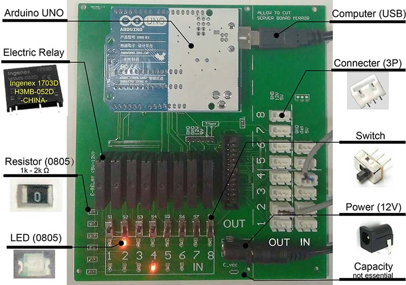
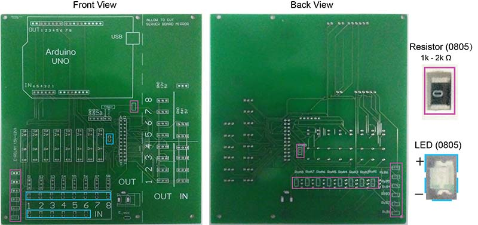
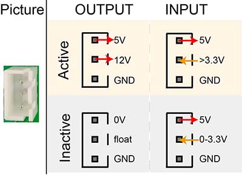

# ArControl PCB Assemble

- Author: Xinfeng Chen (陈昕枫)

- Email  : chenxinfeng@hust.edu.cn

- ​Cite This:

  > Xinfeng Chen, Haohong Li. 2017. ArControl: An Arduino-based comprehensive behavioral platform with real-time performance. (In Press)

## 1. The Finished Product of PCB

---

You're recommended to construct  the `ArControl_PCB/mainboard_V2` as below. You can use it to monitor **INs** and control **OUTs**  through the identical **Connecters**. 

The **shopping list** , in `ArControl_ShoppingList`, is directly available in *China*.  Though it's cheap and easy, this type of **Electric Relay** ("Ingenex 1703D H3MB-052D") may be inaccessible outside *China*. Still, it could be replaced, such as "Kyoto Electric KF0602D DC-to-DC Solid State Relay" in Amazon.

> Construction of the ArControl PCB (mainboard_V2).

## 2. Discriminate LEDs and Resistors

---

Be careful that the prints of LEDs and Resisitors are quite similar.

> The front view and the back view of PCB. The colored rect-lines are specified for LED or Resistor.

## 3. Device Connector

---

The input and output devices are marked as *IN 1-6* and *OUT 1-8*, where they are identically managed managed through ArControl Software and powered by the **Device Connectors**.

> Structure of Device Connector.