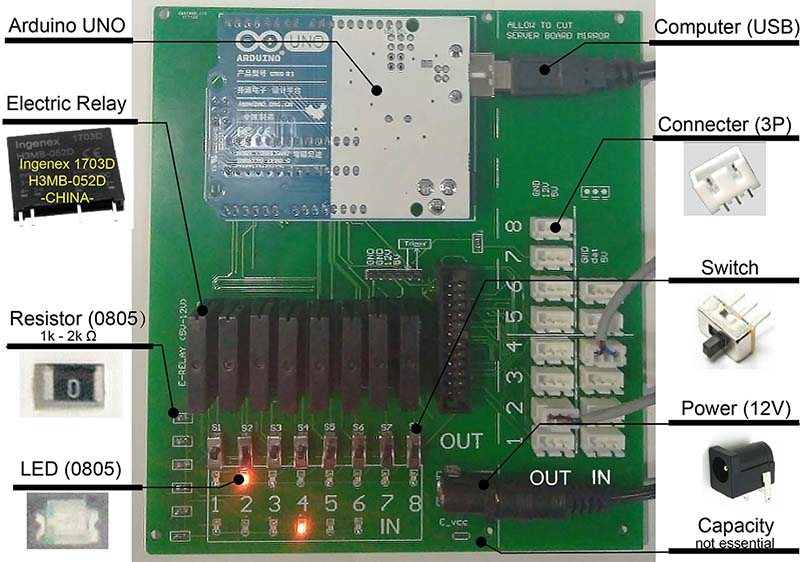
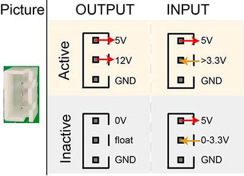

# ArControl PCB 组装

- 作者: 陈昕枫

- 邮箱: chenxinfeng@pku.edu.cn

  ​

## 1. PCB成品

---

建议您使用`ArControl_PCB/mainboard_V2`目录下的PCB，最后组装的效果如下图。您可在在 **IN** 和 **OUT** 标注的连接槽连接相应的设备。

关于购买**元器件清单**，您可以在`ArControl_ShoppingList`目录下找到。里面的元器件都是在中国国内能购买到的。国外的同仁如果无法购买到**继电器**("Ingenex 1703D H3MB-052D")，则可使用 Amazon 上的"Kyoto Electric KF0602D DC-to-DC Solid State Relay" **继电器**进行等效替代。

> ArControl PCB (mainboard_V2) 的完成图。

## 2. 辨别贴片 LED 和电阻

---

这两者的封装很相近，焊接时请一定要分清。

> PCB裸板的前与后视图。颜色框分别标注了 LED 和电阻的位置。

## 3. 从板

---

您可以在 `ArControl_PCB/serverboard` 中找到**从板**，它利于延长电器设备与主要板的连接距离。但是**从板**并不是必须的，它的功能已被主要板集成了。

> 从板的完成图。

## 4. 设备连接槽

---

ArControl使用 IN1-6 和 OUT1-8 来标注输入设备和输出设备。它们统一由软件来控制，由硬件来驱动。

> 设备连接槽的工作示意图。