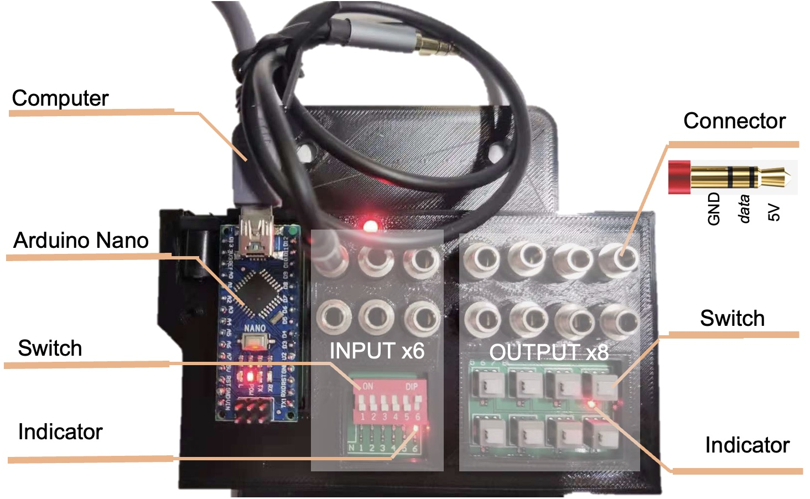

# ArControl PCB Assemble

- Author: Xinfeng Chen (陈昕枫)

- Email  : chenxinfeng@pku.edu.cn

- ​Cite This:

  > Xinfeng Chen, Haohong Li. 2017. ArControl: An Arduino-based comprehensive behavioral platform with real-time performance. (In Press)

## The Finished Product of PCB

---

You're recommended to construct  the `ArControl_PCB/mainboard_V3` as below. You can use it to monitor **INs** and control **OUTs**  through the identical **Connecters**. 

The **shopping list** , in `ArControl_ShoppingList`, is directly available in *China*.  

